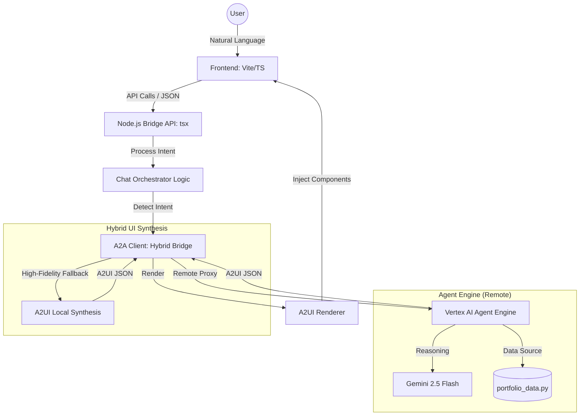

# Enrique K Chan: The Portfolio Agent 🤖✨

A high-fidelity demonstration of **Agentic AI** applied to professional branding. This project transcends static portfolios by leveraging the **A2UI (Agent-Driven User Interface)** protocol and **Gemini 2.5 Flash** to create a living, interactive career ambassador.

## 🏗️ System Architecture

## 🎯 The Vision
Modern portfolios should be as dynamic as the careers they represent. This "Portfolio Agent" is designed to:
- **Tailor the Narrative**: Dynamically synthesize Enrique's 15+ years of experience (Google, AWS, Disney) based on the user's specific interests.
- **Render Intent**: Use the **A2UI Protocol** to automatically generate high-fidelity UI components (Timelines, Trophies, Quizzes) that match the conversational context.
- **Establish Presence**: Provide a premium, "Gemini-inspired" experience that feels like chatting with an executive assistant.
- **Always-A2UI Intelligence**: Almost every query—from cloudcerts to local weather—triggers a sleek visual dashboard instead of just text.

## ✨ The "Gems" (Interactive Capabilities)
The agent features specialized modules (or "Gems") that provide deep-dives into Enrique's history and real-time utility context:

- **📜 Career Historian**: A sequential journey through high-scale engineering and strategy.
- **🎯 Skill Matcher**: Instant analysis of how Enrique's expertise applies to specific roles or problems.
- **📊 Fit Analyzer**: A data-driven comparison of career highlights against enterprise requirements.
- **🌦️ Weather Intel**: Real-time atmospheric conditions (specifically Emerald City vibes 🌧️).
- **📈 Market Flash**: Live-look market data for Alphabet Inc. (GOOGL) and Nasdaq 📊.
- **🕒 Temporal Context**: Precision-synced local time and Gregorian calendar data ⌚.
- **🧠 Knowledge Challenge**: A **dynamic quiz system** that adapts questions based on the conversation topic (Google, AWS, Olympics, or AI Strategy).
- **🎬 Cinema Hub**: Interactive access to keynote sessions and AI thought leadership videos.
- **✍️ Insight Stream**: A curated feed of premium Medium articles on AI architecture and governance.
- **🏆 Trophy Room**: A visual showcase of Google GTM awards and high-stakes hackathon wins.
- **☁️ Cloud Badge Wall**: A full-fidelity rendering of 19x professional certifications (GCP, AWS, Azure).
- **✨ Googler Vibes**: Real-world testimonials and peer feedback from Google leadership (scrollable carousel).
- **🖼️ Hall of Mastery**: A premium visual gallery featuring architectural diagrams and career headshots.

## 🛠️ Advanced Features
- **🎙️ Voice-to-UI**: Integrated Web Speech API for seamless voice-driven exploration.
- **🧠 Session Memory**: Persistent "Recent Chats" sidebar that tracks your exploration history in real-time.
- **🔄 Hybrid Logic**: A dual-layered architecture featuring a remote Agent Engine backend with sub-second client-side A2UI fallbacks.
- **💎 Premium Design**: Custom CSS system featuring Glassmorphism, Backdrop filters, and Obsidian-inspired dark modes.

## 🧰 Technology Stack
- **AI Core**: Gemini 2.x (Flash/Pro) & Google ADK (Agent Development Kit).
- **Protocol**: A2UI (Agent-Driven User Interface) for deterministic UI synthesis.
- **Frontend**: Vite + TypeScript + Custom Web Components (no heavy frameworks).
- **Backend**: Python (FastAPI/Agent Engine) + Node.js (Orchestration).
- **Cloud**: Deployed on Google Cloud Run, Vertex AI, and Firebase.

## 🚀 Quick Deployment (Firebase Hosting)
To get your portfolio live in minutes:
1. **Install Firebase CLI**: `npm install -g firebase-tools`
2. **Login**: `firebase login`
3. **Deploy everything**: `npm run deploy:all -- --project [YOUR_PROJECT_ID]`

For more granular control, see the [Deployment Workflow](.agent/workflows/quick-deploy.md).

## 📁 Project Structure
- `/src`: High-fidelity UI components and the `ChatOrchestrator` logic.
- `/agent`: The "Brains" – Python-based data repository and A2UI synthesis templates.
- `A2AClient.ts**: The bridge managing remote agent calls and high-fidelity fallback states.

---
**Crafted with ❤️ by [Enrique K Chan](https://www.linkedin.com/in/enriquechan/)**  
*Building the future of Agentic Interfaces.*
